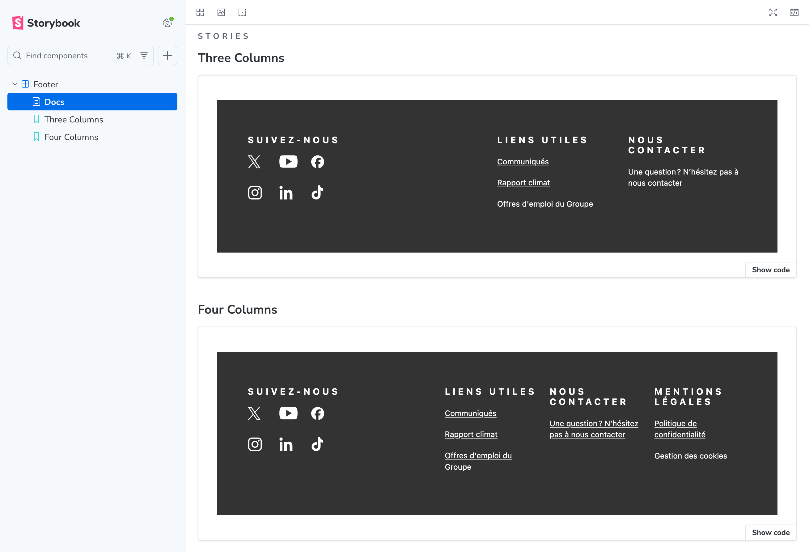
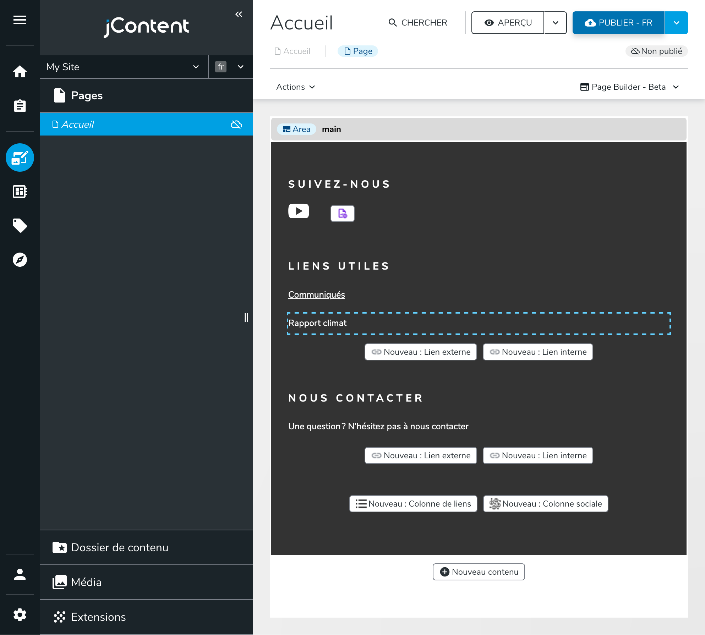

# POC Design System Eiffage

Ce dépôt contient une Preuve de Concept (POC) pour le Design System Eiffage, et son intégration avec Jahia.

Vous trouverez deux paquets dans ce monorepo :

- `packages/design-system`: Un design system React composable, agnostique de tout framework.

  

  Le design system contient un seul composant pour ce POC : un composant `<Footer>`.

  Le design system est documenté avec Storybook.

  ```bash
  # Installer les dépendances
  yarn install

  # Pour démarrer Storybook pour le design system
  yarn workspace design-system storybook dev -p 6006
  ```

- `packages/template-set`: Un template set Jahia qui intègre les composants du design system.

  

  L'objectif est de fournir la meilleure expérience d'édition pour les éditeurs dans Jahia, tout en exploitant les composants du design system.

  Voir [./packages/template-set/README.md](./packages/template-set/README.md) pour plus de détails techniques.

  ```bash
  # Démarrer Jahia
  docker compose up --wait

  # Démarrer le mode de développement
  yarn workspace eiffage-template-set dev
  ```
